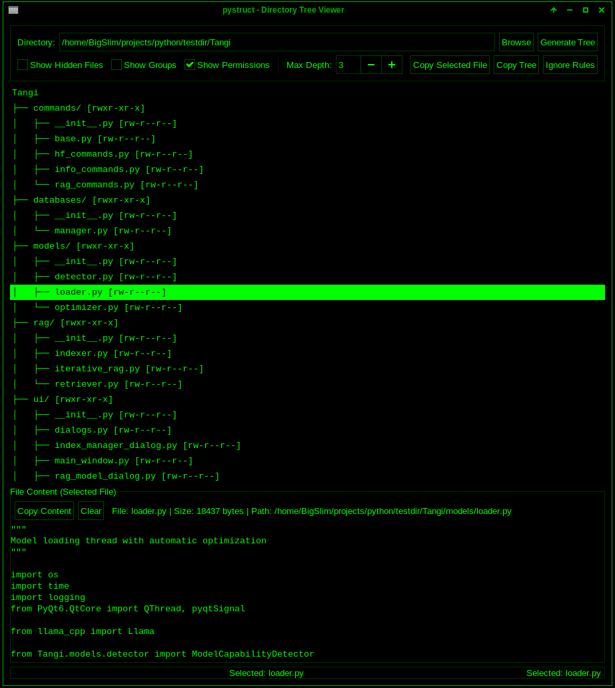

# GTK Directory Tree Viewer (pystruct)

**pystruct** is a Python GTK3 application for generating, viewing, and copying ASCII-style directory trees. It now includes a file content preview panel, full-width row highlighting, and a classic tree view with `├──`, `└──`, and `│` connectors – perfect for developers, sysadmins, and anyone who needs a quick textual overview of a file hierarchy.

---

## Features

- **Browse and select directories** via GTK3 file chooser.
- **ASCII directory tree** with `├──`, `└──`, and `│` connectors in the GUI.
- **File content preview** – click any file to view its contents in a bottom panel.
- **Copy selected file content** to clipboard.
- **Copy entire ASCII tree** to clipboard.
- **Configurable max depth** (1-10) to limit tree expansion.
- **Show/hide hidden files** (overrides ignore patterns).
- **Show permissions** (Unix-style `rwxr-xr-x`) and **show groups** (owner:group).
- **Ignore rules editor** – edit built-in Python-centric patterns (`.venv/`, `__pycache__/`, etc.) via a dialog.
- **Full-width row highlighting** using your system's native GTK theme colors.
- **Resizable split view** – drag the divider to adjust tree vs. preview area size.
- **Light & dark theme toggle** (hacker-green dark theme included).
- **Status bar** with real-time feedback and error reporting.

---

## Requirements

- Python 3.6+
- PyGObject (GTK3)
- System GTK3 libraries

### Install Dependencies

    # In a virtual environment
    pip install PyGObject

    # System packages (example for Ubuntu/Debian)
    sudo apt-get install gir1.2-gtk-3.0

    # Fedora
    sudo dnf install gtk3

    # Arch Linux
    sudo pacman -S gtk3

---

## Installation & Running

    # Clone the repository
    git clone https://github.com/mreinrt/pystruct.git
    cd pystruct

    # Create virtual environment
    python -m venv .venv
    source .venv/bin/activate

    # Install dependencies
    pip install -r requirements.txt

    # Run
    python pystruct.py

---

## Usage Guide

Select a directory using the file chooser.

Configure options:
- Show Hidden Files
- Show Permissions
- Show Groups
- Max Depth

Generate Tree.

Browse:
- Click file to preview contents
- Expand/collapse directories

Copy:
- Copy Selected File
- Copy Tree

Edit ignore rules as needed.

---

## Key Implementation Details

- Uses Gtk.TreeView with TreeStore
- ASCII export preserves connector alignment
- Multi-encoding file preview with binary handling
- Recursive ignore rule system
- Dynamic GTK CSS theming

---

## Project Structure

    pystruct/
    ├── pystruct.py
    ├── requirements.txt
    ├── CHANGELOG.md
    ├── LICENSE
    ├── README.md
    └── media/
        ├── screenshot.png
        ├── tree_view.png
        ├── file_preview.png
        └── ignore_rules.png

---

## Development & Contributing

- Fork repository
- Create branch
- Commit changes
- Push and open PR

---

## License

MIT License

---

## Acknowledgements

GTK3 / PyGObject  
Python ecosystem

---

## About the Developer

Created by BigSlimThic – a developer operating across multiple environments with a focus on practical tooling and systems-level usability.

---

## Donate

BTC: 3GtCgHhMP7NTxsdNjcDs7TUNSBK6EXoAzz  
ETH: 0x5f1ed610a96c648478a775644c9244bf4e78631e  

---

## Links

Repository: https://github.com/mreinrt/pystruct  
Issues: https://github.com/mreinrt/pystruct/issues
