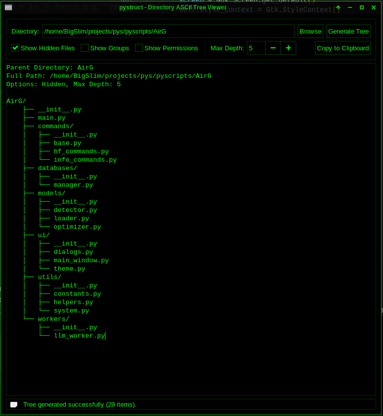
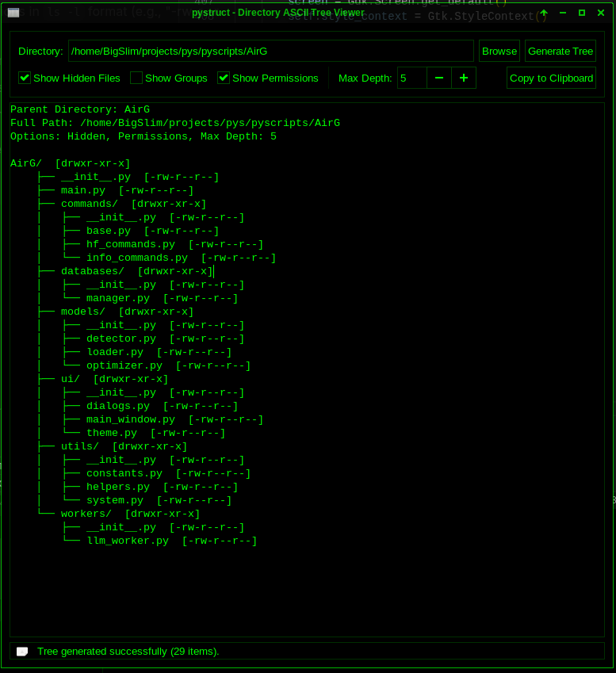
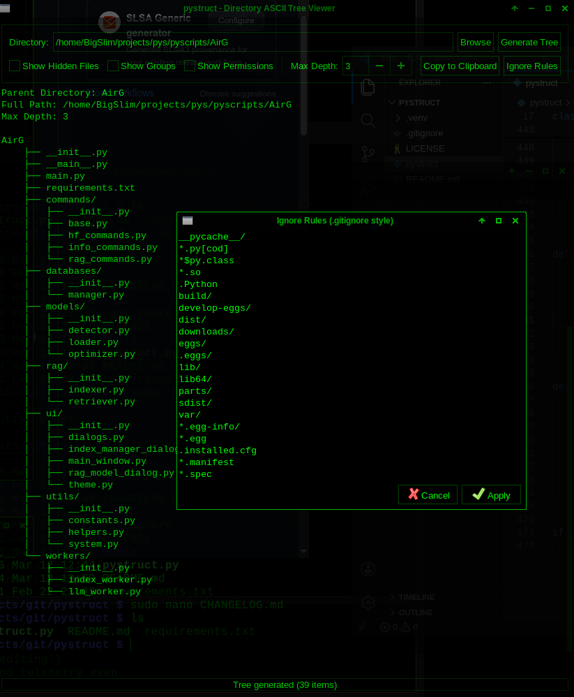

# GTK Directory Tree Viewer (pystruct)

**pystruct** is a Python-based GTK3 application that allows you to visually browse and generate ASCII-style directory trees. Designed for system administrators, developers, and anyone who wants a clear textual representation of a file hierarchy.

---

## Features

- Browse and select directories using a GTK3 file chooser.
- Generate ASCII directory trees with configurable depth.
- Option to show or hide hidden files.
- Switch between dark (hacker-green) and light themes.
- Copy the generated tree to the clipboard.
- Status bar with live updates and error reporting.
- Scrollable, monospace-text view for easy viewing of large directory structures.

*Main widget with options*

*Main widget showing permisions*

*Main widget Ignore Rules*

---

## Requirements

- Python 3.6+
- PyGObject (GTK3)
- System GTK3 libraries

### Installing Dependencies

Use a virtual environment and install PyGObject:

    # Activate your virtual environment first
    pip install PyGObject

    # System packages (example for Ubuntu/Debian)
    sudo apt-get install gir1.2-gtk-3.0

    # Fedora
    sudo dnf install gtk3

    # Arch Linux
    sudo pacman -S gtk3

---

## Running the Application

    # Make sure you are in a virtual environment
    python gtk_directory_tree.py

- If the script detects that it is not running inside a virtual environment, it will warn you and prompt for confirmation before continuing.

---

## Usage

1. **Select a directory**: Use the text entry or click **Browse**.
2. **Set options**:
   - Toggle **Show Hidden Files**.
   - Adjust **Max Depth** to limit tree expansion.
3. **Generate tree**: Click **Generate Tree**.
4. **Copy tree**: Click **Copy to Clipboard** to copy ASCII tree text.
5. **Switch theme**: Click **Switch to Light/Dark Theme**.

The status bar will provide feedback, including errors and success messages.

---

## Key Implementation Details

- Uses `Gtk.TextView` with monospace font for displaying directory trees.
- CSS-based theming allows a dark hacker-green theme and a light theme.
- Recursive tree generation stops at `max_depth` to prevent overly deep traversal.
- Handles permission errors gracefully by displaying `[Permission Denied]`.
- Clipboard integration allows quick copying of the generated tree.

---

## Project Structure

    gtk_directory_tree.py   # Main application script

- All logic is contained in a single Python file for portability.
- No external configuration files are required.

---

## Notes

- Tested on Linux systems with GTK3 support.
- Virtual environment recommended for dependency isolation.
- The app is designed for local file browsing; no network file access is implemented.
- Exception handling included for permission issues, missing directories, and clipboard failures.

---

## License

MIT License — free to use, modify, and distribute.

---

## Contact / Support

For issues or suggestions, please open an issue in the repository or contact the maintainer directly.

## About the Dev

OCRCAP was created by BigSlimThic, a hopelessly broke digital low-life who somehow grew up somewhere between Philadelphia and probably South East Asia, surviving on instant noodles and bad Wi-Fi. Rumor has it he has a smoking hot girlfriend, unless she left him for a guy with a real job. Against all odds, he somehow managed to survive the apocalypse of homelessness, poverty, and questionable life choices to create this AI.

## Donate

Donate to BigSlimThic: Help fund his lifelong quest to buy an ergonomic chair, 
a better Wi-Fi router, and possibly a vacation somewhere that isn't just his imagination.

BTC: 3GtCgHhMP7NTxsdNjcDs7TUNSBK6EXoAzz

ETH: 0x5f1ed610a96c648478a775644c9244bf4e78631e